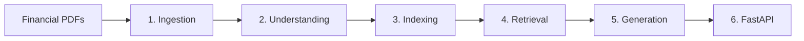

# Multimodal Financial Intelligence RAG System

A specialized Multimodal Retrieval-Augmented Generation (RAG) system built to ingest, parse, and analyze complex financial disclosures (e.g., SEC 10-Ks, annual reports, earnings presentations). The system extracts narrative text, structured tables, and visual charts/images, leverages Google Gemini as the sole LLM/multimodal/embedding provider to comprehend multimodal elements, and generates analyst-grade answers backed by verifiable citations.

> **Note**: Google Gemini is the sole LLM and embedding provider across all understanding, indexing, and synthesis stages of this project.

---

## Architecture & Pipeline Overview

The pipeline consists of six sequential stages:



1. **Ingestion (`app/ingestion/`)**:
   - Parses multi-page financial PDFs using PyMuPDF / OCR.
   - Extracts narrative text, tabular data, and raw chart/figure images with bounding boxes (`bbox`) and page numbers.

2. **Understanding (`app/understanding/`)**:
   - Sends visual chart and graphic elements to the Gemini Multimodal API.
   - Converts visual trends, bar/line charts, and financial graphics into rich, structured textual descriptions and data points.

3. **Indexing (`app/indexing/`)**:
   - Generates vector embeddings for all extracted document elements (text blocks, markdown tables, and chart descriptions) using Gemini Embedding models (e.g., `models/text-embedding-004`).
   - Persists dense vectors and rich metadata into a ChromaDB vector store.

4. **Retrieval (`app/retrieval/`)**:
   - Implements hybrid retrieval combining semantic vector search, keyword matching, and financial metadata filtering (e.g., company ticker, fiscal year).
   - Reranks candidate document elements for context synthesis.

5. **Generation (`app/generation/`)**:
   - Uses Gemini LLM reasoning to synthesize comprehensive answers to financial analyst queries (e.g., multi-year revenue growth, operating margin dynamics, geographic segment performance).
   - Produces grounded citations referencing source documents, page numbers, element types, and bounding coordinates.

6. **API (`app/api/`)**:
   - Exposes RESTful endpoints via FastAPI for document uploading/processing, vector indexing status, and analyst Q&A querying.

---

## Directory Structure

```text
financial_rag/
├── app/
│   ├── ingestion/        # PDF parsing, text/table/image extraction
│   ├── understanding/    # chart/image → structured description via Gemini
│   ├── indexing/         # embeddings + vector store logic
│   ├── retrieval/        # hybrid retrieval logic
│   ├── generation/       # answer synthesis + citation logic
│   ├── api/              # FastAPI app
│   └── core/             # shared config, schemas, utils
│       ├── config.py     # Pydantic Settings loading from .env
│       └── schemas.py    # DocumentElement, Citation, QueryResult models
├── data/
│   ├── raw_pdfs/         # Inbound financial PDFs (10-Ks, annual reports, earnings decks)
│   ├── processed/        # Extracted elements, cropped charts, and intermediate artifacts
│   └── vector_store/     # ChromaDB vector store directory
├── tests/                # Test suite
├── requirements.txt      # Pinned dependencies (Gemini stack, FastAPI, ChromaDB)
├── .env.example          # Environment variable template
└── README.md             # Project documentation
```

---

## Quick Start & Setup

### 1. Environment Setup

```bash
# Create virtual environment
python -m venv venv

# Activate virtual environment (Windows)
venv\Scripts\activate
# Or on Linux/macOS:
# source venv/bin/activate

# Install dependencies
pip install -r requirements.txt
```

### 2. Configure Environment Variables

Create your `.env` file from the provided example template:

```bash
cp .env.example .env
```

Set the required environment variables:
- `GEMINI_API_KEY`: Your Google Gemini API key.
- `GEMINI_MODEL_NAME`: Gemini model name (default: `gemini-1.5-pro-latest`).
- `EMBEDDING_MODEL_NAME`: Gemini embedding model (default: `models/text-embedding-004`).
- `VECTOR_STORE_PATH`: Local directory for ChromaDB (default: `./data/vector_store`).
- `CHUNK_SIZE`: Text chunk size (default: `1000`).
- `CHUNK_OVERLAP`: Text chunk overlap (default: `200`).

---

## Core Data Schema

All extracted elements are normalized into a `DocumentElement`:

- **`element_id`**: Unique identifier for the element.
- **`doc_name`**: Name of the source document (e.g., `AAPL_2023_10K.pdf`).
- **`page_number`**: 1-based page index.
- **`element_type`**: `text` | `table` | `chart` | `image`.
- **`content`**: Text narrative, Markdown table representation, or Gemini multimodal chart description.
- **`metadata`**: Financial domain metadata (ticker, fiscal year, metrics).
- **`bbox`**: Bounding box coordinates `(x0, y0, x1, y1)` for provenance and visual citations.
